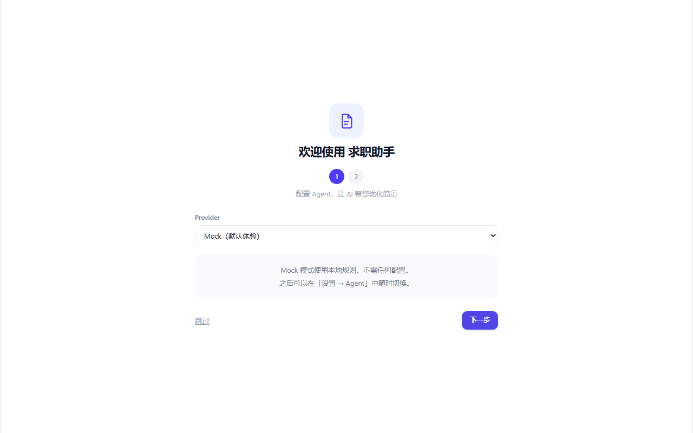
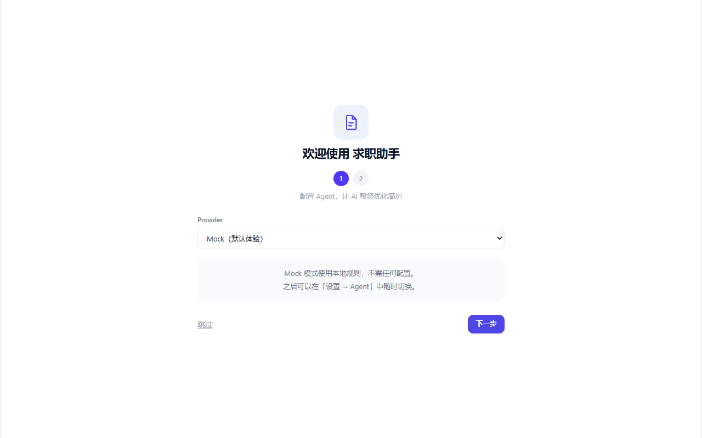
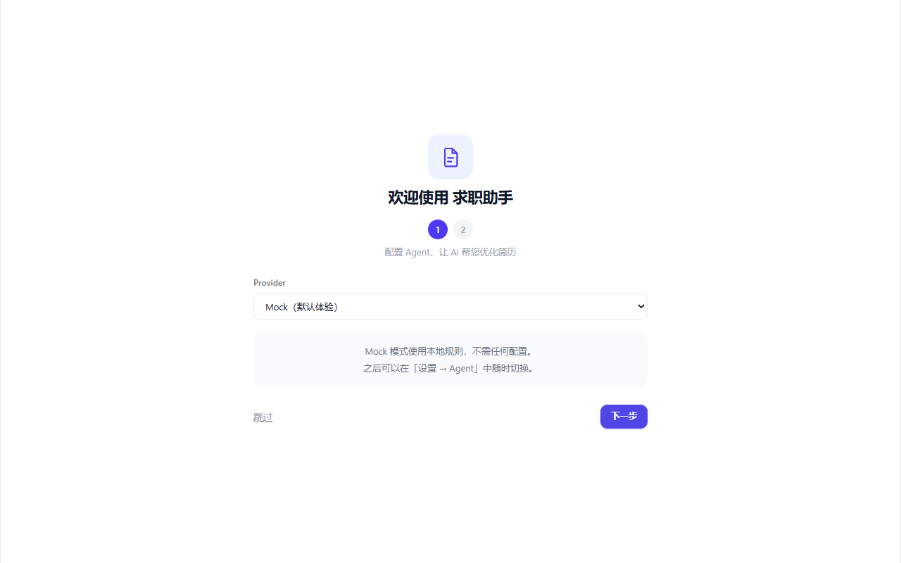
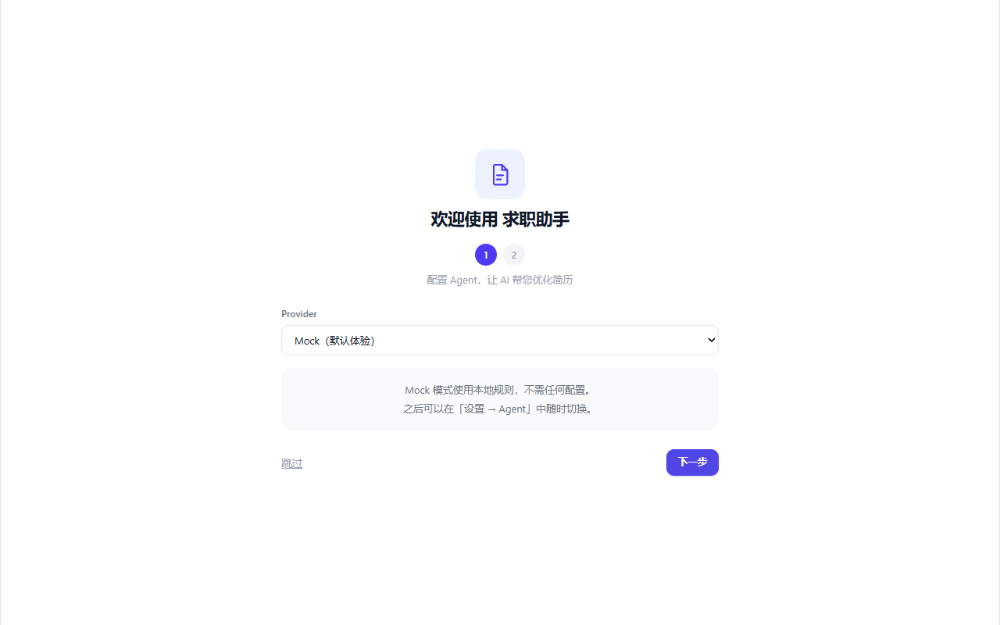
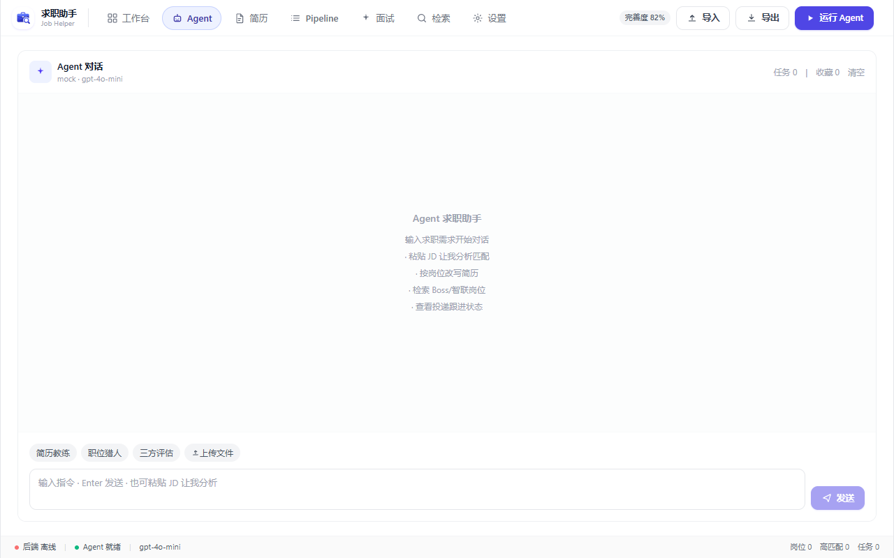

# 🎯 求职助手 (Job Helper)

<div align="center">

**AI 驱动的求职桌面应用**

[](https://github.com/555cute/job-helper/stargazers)
[](https://github.com/555cute/job-helper/blob/master/LICENSE)

</div>


---

## ✨ 核心功能

<table>
<tr>
<td width="50%">

### 🤖 Agent 对话
内置 **简历教练 / 职位猎人 / 三方评估** 3 个专家技能。支持多轮对话、工具调用、文件上传（PDF/图片/Word）。

</td>
<td width="50%">


</td>
</tr>
<tr>
<td width="50%">



</td>
<td width="50%">

### 📝 简历管理
Agent 对话式创建简历，逐段引导填写个人信息、工作经历、项目经验、技能等。支持 PDF/Word/图片上传解析，自动提取文本交给 Agent 分析。

</td>
</tr>
<tr>
<td width="50%">

### 🔍 岗位检索
一键搜索 **Boss直聘** / **智联招聘** / **猎聘** 3 个平台。搜索结果按匹配度打分排序，支持城市筛选、薪资过滤、一键加入投递 Pipeline。

</td>
<td width="50%">



</td>
</tr>
<tr>
<td width="50%">



</td>
<td width="50%">

### 📊 投递 Pipeline
6 列看板管理投递进度：收藏 → 待投递 → 已投递 → 面试中 → Offer → 淘汰。每张卡片显示薪资、公司、城市，支持星标收藏和快速删除。

</td>
</tr>
<tr>
<td width="50%">

### 🎤 模拟面试
AI 面试官根据简历和 JD 逐题提问，实时验证回答质量、深度追问，最后生成结构化评估报告（多维评分 + 亮点 + 改进建议）。

</td>
<td width="50%">



</td>
</tr>
</table>

---

## 🚀 快速开始

```bash
# 1. 克隆项目
git clone https://github.com/555cute/job-helper.git
cd job-helper

# 2. 安装依赖
npm install

# 3. 启动桌面端（后端 + 前端 + Electron 同时启动）
npm run dev:desktop
```

- **前端**: http://127.0.0.1:5173
- **后端**: http://127.0.0.1:47821

---

## ⚙️ 配置

### 1. 配置 AI 模型

打开设置 → Agent，填入任意 OpenAI Compatible API：

| 提供商 | Base URL | 说明 |
|--------|----------|------|
| opencode.ai | `https://opencode.ai/zen/v1` | 免费额度 |
| OpenAI | `https://api.openai.com/v1` | 需要 API Key |
| Ollama | `http://127.0.0.1:11434/v1` | 本地运行 |



### 2. 配置数据源

设置 → 数据源 → 点击「获取 Cookie」→ 弹窗中登录 → Cookie 自动填入。

支持的平台：
- **Boss直聘** (zhipin.com)
- **智联招聘** (zhaopin.com)
- **猎聘** (liepin.com)


---

## 🏗️ 技术栈

| 层 | 技术 |
|----|------|
| 前端 | React 19 · TypeScript · Vite 8 · Tailwind CSS 4 |
| 桌面 | Electron |
| 后端 | Express 5 · Node.js |
| AI | OpenAI Compatible API（支持函数调用 / Tool Calling） |
| 文件 | pdfjs-dist (PDF) · mammoth (DOCX) · tesseract.js (OCR) |

---

## 📁 项目结构

```
job-helper/
├── electron/             # Electron 主进程 + IPC
│   ├── main.cjs          # 窗口管理、后台进程、Cookie 提取
│   └── preload.cjs       # 安全暴露 API 到渲染进程
├── server/               # Express 后端
│   ├── index.js          # API 路由
│   ├── lib/              # 工具库
│   │   ├── fileParser.js # PDF/DOCX/图片 文本提取
│   │   ├── proxy.js      # 代理自动检测
│   │   └── ...
│   └── services/         # 业务逻辑层
│       ├── agent.js      # Agent 引擎（工具调用循环）
│       ├── interview.js  # 模拟面试逻辑
│       └── search/       # 平台爬虫
│           ├── boss.js   # Boss直聘
│           ├── zhilian.js# 智联招聘
│           └── liepin.js # 猎聘
├── src/                  # React 前端
│   ├── components/       # 通用组件（Onboarding、ResumePreview 等）
│   ├── pages/            # 页面
│   │   ├── AgentPage.tsx
│   │   ├── ResumePage.tsx
│   │   ├── SearchPage.tsx
│   │   ├── PipelinePage.tsx
│   │   ├── InterviewPage.tsx
│   │   └── WorkbenchPage.tsx
│   └── state/            # AppContext 全局状态
└── scripts/              # 辅助脚本
```

---

## 🔧 开发

```bash
# 前端开发（带热更新）
npm run dev:web

# 仅后端
npm run dev:server

# 构建生产版本
npm run build
```

---

## 📄 License

MIT
